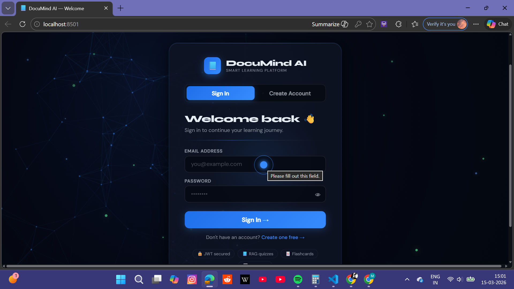
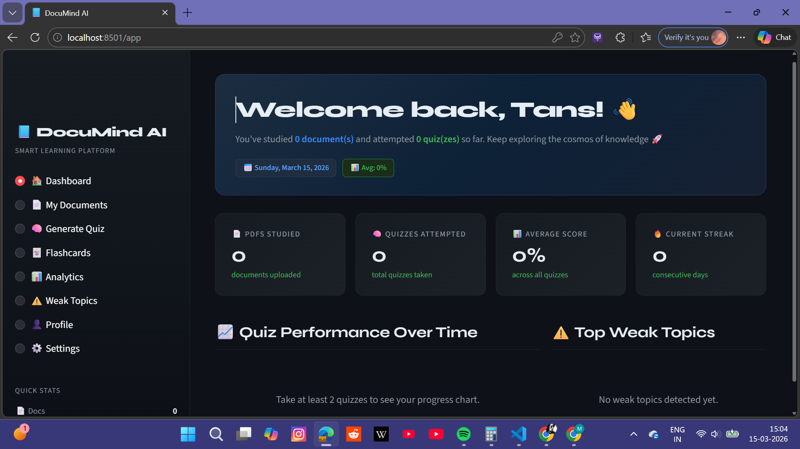
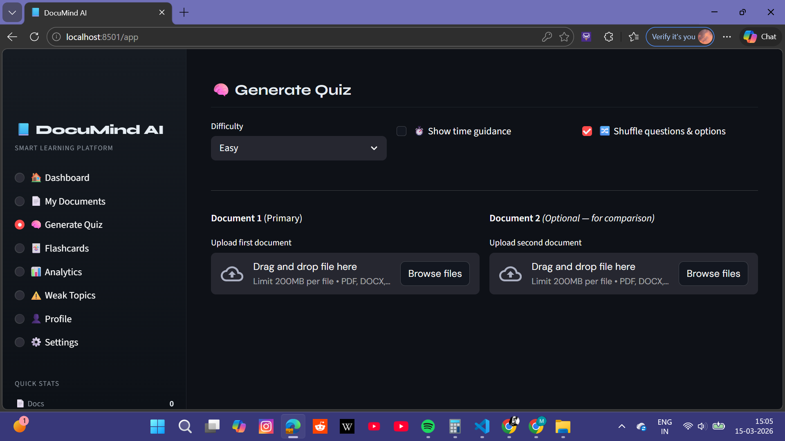
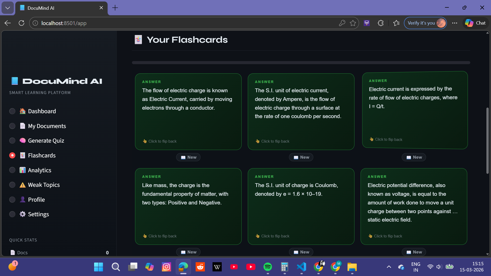

# 🚀 DocuMind-AI

## AI-Powered Document Learning & Semantic Analysis Platform

**DocuMind-AI** is an AI-powered document intelligence platform that transforms static PDFs into an **interactive learning environment**.

Users can upload documents and automatically generate:

- 📚 **Quizzes**
- 🧾 **Summaries**
- 🗂 **Flashcards**

The platform also tracks **learning progress, quiz history, performance analytics, and daily learning streaks**, creating a complete **AI-assisted study system**.

DocuMind-AI combines **vector embeddings, semantic search, and Large Language Models (LLMs)** to intelligently understand documents and create personalized learning experiences.

---

# ✨ Key Features

## 📚 **AI Quiz Generation from PDFs**

- Upload academic or technical PDFs  
- Automatically generate quiz questions  
- Supports **multiple difficulty levels**

Difficulty Levels:

- Easy  
- Medium  
- Hard  

---

## 🎯 **Difficulty-Based Quiz Selection**

Users can choose the difficulty level before starting a quiz.

Questions are dynamically generated based on the selected difficulty.

---

## 🧾 **Automatic Document Summaries**

DocuMind-AI generates **concise summaries** from uploaded PDFs so users can quickly understand large documents.

---

## 🗂 **Flashcard Generation**

The system automatically creates **flashcards from document content** for:

- Quick revision  
- Concept reinforcement  
- Efficient learning  

---

## 🔎 **Semantic Document Version Comparison**

DocuMind-AI compares **old and updated versions of documents** using semantic similarity.

It detects:

- Added sections  
- Modified content  
- Removed information  

Questions are regenerated **only for updated sections**.

---

## 🧠 **Weak Area Detection**

After completing quizzes:

- Incorrect answers are analyzed  
- Weak concepts are identified  
- Users are directed to review relevant document sections  

---

## 📊 **Learning Progress Tracking**

The platform records user learning data including:

- Quiz scores  
- Performance trends  
- Learning analytics  

Users can track their **improvement over time**.

---

## 📜 **Quiz History**

Users can view a complete history of quizzes including:

- Quiz topics  
- Scores  
- Timestamps  

---

## 🔥 **Daily Learning Streak**

DocuMind-AI tracks **consecutive days users complete quizzes**, encouraging consistent study habits.

---

## 🔐 **Authentication System**

Secure login system enabling:

- Personalized dashboards  
- Saved progress  
- Quiz history tracking  

---

# 🏗 System Architecture

DocuMind-AI follows a **Retrieval-Augmented Generation (RAG)** architecture.

```
User Uploads PDF
        │
        ▼
PDF Text Extraction
        │
        ▼
Text Chunking
        │
        ▼
Embedding Generation
        │
        ▼
Vector Database (ChromaDB)
        │
        ▼
Semantic Retrieval
        │
        ▼
LLM Processing
        │
        ▼
Quiz / Flashcards / Summaries
```

---

# ⚙️ Tech Stack

## 🧠 AI / Machine Learning

- Large Language Models (LLMs)  
- Prompt Engineering  
- Semantic Similarity  
- Vector Embeddings  

---

## 🐍 Backend

- **Python**  
- **FastAPI**

---

## 🎨 Frontend

- **Streamlit**

---

## 📦 Vector Database

- **ChromaDB**

---

## 🗄 Database

- **SQLite**

---

## 📚 Libraries

- LangChain  
- Sentence Transformers  
- PyPDF  
- NumPy  
- Pandas  

---

# 📂 Project Structure

```
DocuMind-AI
│
├── backend
│   ├── auth_api.py
│   ├── main.py
│   └── services
│       └── weak_area_analyzer.py
│
├── frontend
│   ├── streamlit_app.py
│   └── auth_utils.py
│
├── semantic_versioning
│   └── document_comparator.py
│
├── pages
│
├── data
│   ├── chroma_db
│   └── documind_users.db
│
├── login.py
├── requirements.txt
└── README.md
```
# 📸 Demo

## 🔐 Login Page


---

## 📊 Dashboard


---

## 📝 Quiz Generation


---

## 🗂 Flashcards


---

# 🖥 Installation

## 1️⃣ Clone Repository

```bash
git clone https://github.com/tanishipss/Documind-ai.git
cd Documind-ai
```

---

## 2️⃣ Create Virtual Environment

```bash
python -m venv venv
```

Activate environment:

### Windows

```bash
venv\Scripts\activate
```

### Mac / Linux

```bash
source venv/bin/activate
```

---

## 3️⃣ Install Dependencies

```bash
pip install -r requirements.txt
```

---

# ▶️ Running the Application

DocuMind-AI requires **two backend APIs and one frontend interface**.

---

## 1️⃣ Start Authentication API

```bash
uvicorn backend.auth_api:app --reload --port 8001
```

Handles:

- user authentication  
- login system  
- user records  

---

## 2️⃣ Start Main Backend API

```bash
uvicorn backend.main:app --reload --port 8000
```

Handles:

- document processing  
- embeddings  
- quiz generation  
- summaries  
- flashcards  
- analytics  

---

## 3️⃣ Start Frontend

```bash
streamlit run login.py
```

Launches the **DocuMind-AI interface**.

---

# 📊 Example Workflow

1️⃣ User logs into the platform  
2️⃣ Uploads a PDF document  
3️⃣ AI extracts document text  
4️⃣ Text is converted into **vector embeddings**  
5️⃣ Stored in **ChromaDB vector database**  
6️⃣ AI generates:

- quizzes  
- summaries  
- flashcards  

7️⃣ User selects quiz difficulty  
8️⃣ User completes the quiz  
9️⃣ Weak areas are identified  
🔟 Progress, history, and streak are recorded  

---

# 🎯 Use Cases

- 📚 Students preparing for exams  
- 👩‍🏫 Teachers generating quizzes  
- 📑 Researchers reviewing documents  
- 🏢 Enterprises analyzing documentation  
- 📖 Self-learners studying technical material  

---

# 👩‍💻 Author

**Tanisha Yadav**

B.Tech | AI/ML  
Building intelligent systems for document understanding and AI-assisted learning.

GitHub:  
https://github.com/tanishipss

---

⭐ **DocuMind-AI transforms static documents into intelligent learning companions.**
